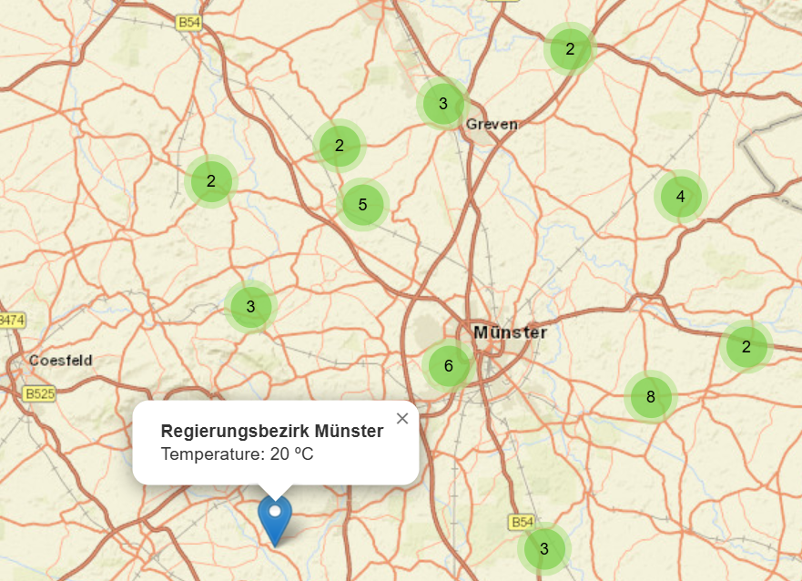

# Weather Station Map

An interactive web map that displays nearby weather stations using the **OpenWeatherMap API** and **Leaflet.js**. The application uses the user's browser location to find nearby weather stations and displays them as interactive markers.

## Preview



## Features

* 📍 Uses browser geolocation to detect the user's location
* 🌦️ Retrieves nearby weather stations from the OpenWeatherMap API
* 🗺️ Displays weather stations on an interactive Leaflet map
* 📌 Uses marker clustering to organize multiple nearby stations
* 🌡️ Shows the station name and temperature when a marker is clicked
* 🔄 Automatically loads weather stations based on the user's current location
* 🖥️ Responsive full-screen map interface

## Technologies Used

* HTML5
* CSS3
* JavaScript
* Leaflet.js
* Leaflet MarkerCluster
* OpenWeatherMap API
* Browser Geolocation API

## How It Works

When the application is opened, it requests permission to access the user's location through the browser's Geolocation API.

Once the location is available, the application sends the latitude and longitude to the OpenWeatherMap API and requests nearby weather stations.

The returned stations are displayed on the Leaflet map using clustered markers. Each marker contains a popup showing the weather station's name and its current temperature.

## API Key

This project uses the OpenWeatherMap API.

For security, the API key is not included in this repository. Before running the project, replace the placeholder in `index.html` with your own OpenWeatherMap API key:

```javascript
var OWM_key = "YOUR_OPENWEATHER_API_KEY_HERE";
```

**Do not publish your personal API key on GitHub.**

## How to Run

1. Clone or download this repository.
2. Open `index.html` in a web browser.
3. Allow the browser to access your location when prompted.
4. The map will automatically load nearby weather stations.
5. Click a marker to view the station name and temperature.

For best results, run the project using a local development server such as VS Code Live Server.

## Project Structure

```text
weather-station-map/
├── index.html
├── README.md
└── screenshot-map.png
```

## Project Purpose

This project demonstrates how web mapping technologies and external APIs can be combined to create an interactive location-based application. It provides experience with Leaflet.js, API requests, browser geolocation, interactive map markers, and marker clustering.

## Author

Developed as a web mapping and data visualization project.


