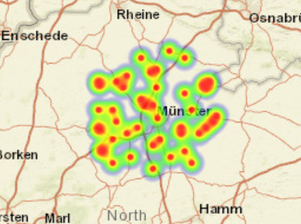

# OpenWeatherMap Weather Station Heatmap

An interactive map visualization that displays nearby weather stations using a heatmap. The application uses the user's location to find weather stations in the surrounding area.

## Preview



## Features

* Interactive Leaflet map
* Browser-based geolocation
* Weather station data from OpenWeatherMap
* Heatmap visualization of nearby stations
* Automatic map positioning based on the user's location
* Fallback location for Castellón, Spain when geolocation is unavailable

## Technologies

* HTML5
* CSS3
* JavaScript
* Leaflet.js
* OpenWeatherMap API
* Leaflet Heatmap
* Browser Geolocation API

## How It Works

The application first attempts to obtain the user's current location through the browser Geolocation API.

The latitude and longitude are then used to request nearby weather stations from OpenWeatherMap. The returned station coordinates are converted into heatmap data and displayed on an interactive Leaflet map.

If the user's location cannot be obtained, the application falls back to Castellón, Spain.

## API Key

The OpenWeatherMap API key is intentionally not included in this repository.

To run the project, open `script.js` and replace:

```javascript
const API_KEY = "YOUR_OPENWEATHER_API_KEY_HERE";
```

with your own OpenWeatherMap API key.

## How to Run

1. Clone or download this repository.
2. Add your OpenWeatherMap API key to `script.js`.
3. Open `index.html` using a local development server.
4. Allow location access when prompted.
5. Explore the interactive weather station heatmap.

## Purpose

This project was created to practice working with external APIs, browser geolocation, interactive maps, and geographical data visualization using JavaScript and Leaflet.
